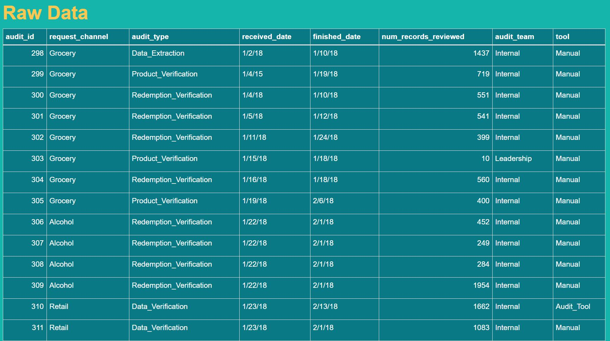
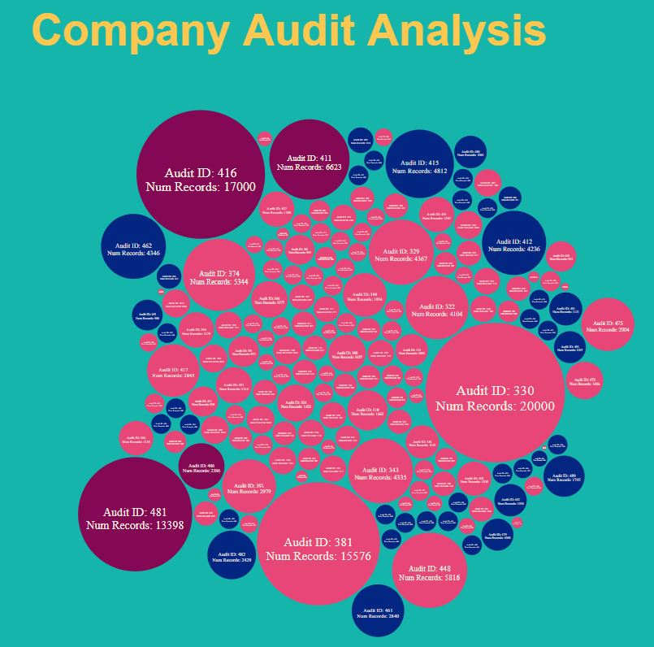
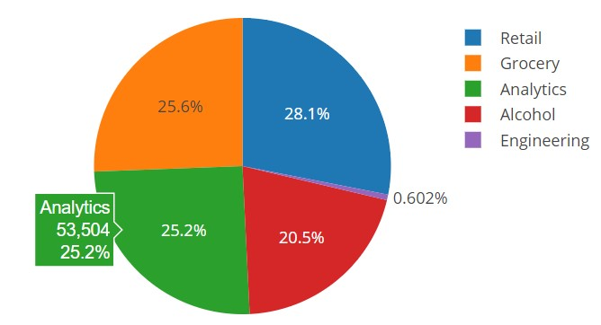
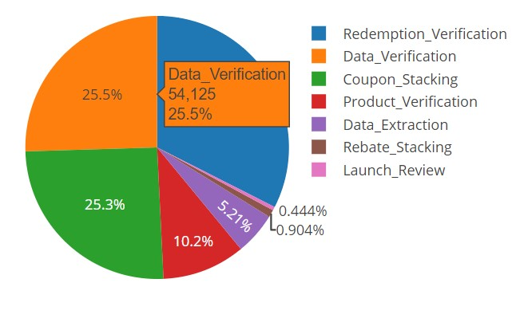

## Digital Coupon Company Audit Data

- Audit information from a local start up that tracks how discounts are used and in what industries deployed in a Flask application

- Languages & Tools:
  - Pandas
  - Jupyter Notebook
  - HTML
  - CSS
  - Flask
  - BeautifulSoup
  
### Data Table

#### Flask Application Visuals

